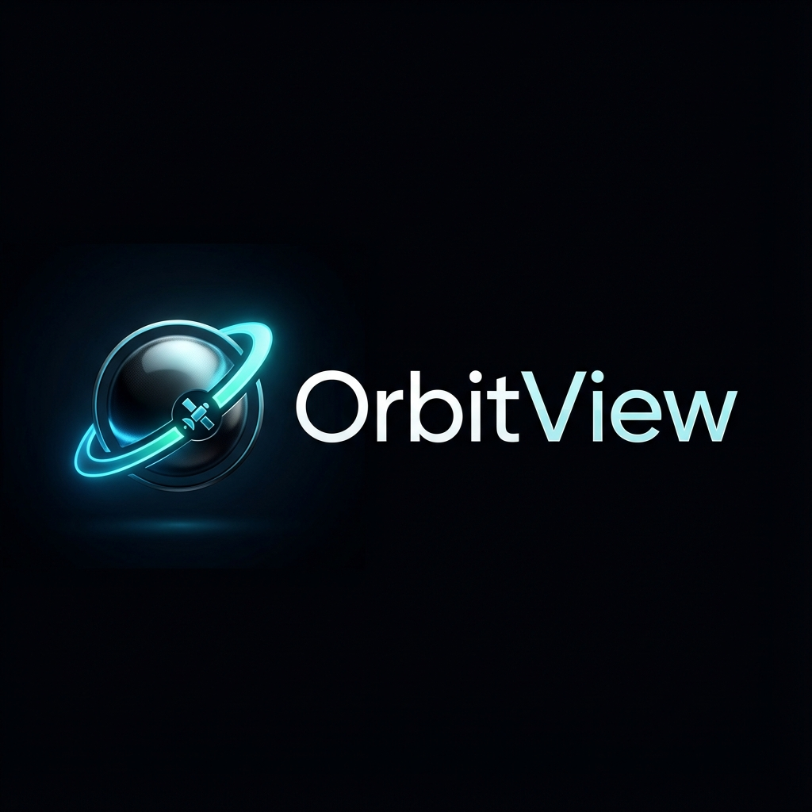

# OrbitView 🛰️

<div align="center">
  
  
  **Real-time satellite tracking and orbital analysis platform**

  [](LICENSE)
  [](https://nextjs.org/)
  [](https://cesium.com/)
  [](https://www.typescriptlang.org/)
  [](https://orbitview.vercel.app)

  [Demo](https://orbitview.vercel.app) • [Features](#features) • [Quick Start](#quick-start) • [Documentation](#documentation) • [Scientific Validation](#scientific-validation) • [Contributing](#contributing)
</div>

---

<div align="center">
  <p><b>Scientific Satellite Tracker & Orbital Analysis</b></p>
  
</div>

---

## ✨ Features

- 🌍 **Interactive 3D Globe** - Real-time visualization of 25,000+ satellites and space objects
- 🔬 **Scientific Analysis** - Doppler shift, orbital decay, conjunction analysis, pass prediction
- 🛰️ **Professional TLE Hub** - Multi-source fallback (Space-Track, CelesTrak, AMSAT)
- ☀️ **Eclipse Detection** - Real-time sunlight/shadow status for all objects
- ⛓️ **Deep Linking** - Share specific satellites via URL (e.g., `?sat=25544`)
- ⏱️ **Time Travel** - Simulate orbits at any point in history or future
- 📱 **Mobile-Friendly** - Responsive design with touch-optimized bottom sheet UI
- 🧭 **AR Compass Mode** - Use device orientation to spot satellites in the sky
- ⌨️ **Power User Tools** - Keyboard shortcuts, analyst mode, and TLE exporting
- ⭐ **Favorites System** - Save and quickly access your favorite satellites

## 🚀 Quick Start

### Prerequisites

- Node.js 18+ 
- npm or yarn

### Installation

```bash
# Clone the repository
git clone https://github.com/SpaceEngineerSS/OrbitVieW.git
cd orbitview

# Install dependencies
npm install

# Start development server
npm run dev
```

Open [http://localhost:3000](http://localhost:3000) to see the app.

## 🛠️ Tech Stack

| Technology | Purpose |
|------------|---------|
| [Next.js 16](https://nextjs.org/) | React framework with App Router |
| [CesiumJS](https://cesium.com/) + [Resium](https://resium.reearth.io/) | 3D globe visualization |
| [satellite.js](https://github.com/shashwatak/satellite-js) | SGP4/SDP4 orbital propagation |
| [TailwindCSS](https://tailwindcss.com/) | Utility-first CSS |
| [Framer Motion](https://www.framer.com/motion/) | Animations |
| [Lucide React](https://lucide.dev/) | Icons |

## 📖 Documentation

### Project Structure

```
src/
├── app/                 # Next.js App Router pages
├── components/
│   ├── HUD/            # Heads-up display components
│   │   ├── Sidebar.tsx
│   │   ├── Timeline.tsx
│   │   └── ...
│   └── Scientific/     # Analysis tools
│       ├── DopplerPanel.tsx
│       ├── DecayPanel.tsx
│       └── ...
├── lib/                # Core calculations
│   ├── DopplerCalculator.ts
│   ├── OrbitalDecay.ts
│   ├── ConjunctionAnalysis.ts
│   └── PassPrediction.ts
└── hooks/              # Custom React hooks
```

### Keyboard Shortcuts

| Key | Action |
|-----|--------|
| `/` | Focus search |
| `F` | Toggle favorite |
| `R` | Random satellite |
| `Space` | Toggle play/pause |
| `Escape` | Close panels |
| `?` | Show shortcuts |
| `A` | Toggle Analyst Mode |

### Scientific Features

#### Doppler Shift Calculator
Calculate frequency shifts for satellite radio signals based on relative velocity.

#### Orbital Decay Prediction
Estimate satellite lifetime using atmospheric drag models and B* coefficients.

#### Conjunction Analysis
Analyze close approach events between space objects with risk assessment.

#### Pass Prediction
Predict when satellites will be visible from your location with sky plots.

## 🌐 Data Sources

- **Space-Track.org**: Official source for 25,000+ active payload and debris TLEs
- **CelesTrak**: Secondary mirror and supplemental data provider
- **NASA Horizons**: High-precision ephemeris for deep space missions (JWST)
- **SatNOGS**: Real-time frequency and communication metadata

## 🤝 Contributing

Contributions are welcome! Please read our [Contributing Guide](CONTRIBUTING.md) for details.

1. Fork the repository
2. Create your feature branch (`git checkout -b feature/amazing-feature`)
3. Commit your changes (`git commit -m 'Add amazing feature'`)
4. Push to the branch (`git push origin feature/amazing-feature`)
5. Open a Pull Request

## 📄 License

This project is licensed under the MIT License - see the [LICENSE](LICENSE) file for details.

## 🔬 Scientific Foundation

OrbitView is built on rigorous astrodynamic principles. Higher-level descriptions can be found in [THEORY.md](THEORY.md).

### Scientific Validation Reports
- [Doppler Shift Validation](docs/validation/doppler_validation.md) - Algorithm comparison vs observations.
- [Pass Prediction Accuracy](docs/validation/pass_prediction_accuracy.md) - Timing accuracy analysis.
- [Atmospheric Decay Model](docs/validation/decay_model_comparison.md) - Density model comparisons.

### Core References
* **Vallado, D. A. (2013).** *Fundamentals of Astrodynamics and Applications*. 4th Edition.
* **Hoots, F. R., & Roehrich, R. L. (1980).** *Models for Propagation of NORAD Element Sets*. Spacetrack Report #3.
* **Kelso, T. S.** *CelesTrak: "Spacecraft Orbits" columns*. [celestrak.org](https://celestrak.org/columns/).

## 👨‍💻 Developer

This project was developed by **Mehmet Gümüş**.

🌐 **Website:** [spacegumus.com.tr](https://spacegumus.com.tr)  
🐙 **GitHub:** [OrbitVieW](https://github.com/SpaceEngineerSS/OrbitVieW)  
𝕏 **X (Twitter):** [@persesmg](https://x.com/persesmg)  
📧 **Email:** [contact@spacegumus.com.tr](mailto:contact@spacegumus.com.tr)

## 🙏 Acknowledgments

- [CelesTrak](https://celestrak.org/) for satellite TLE data
- [CesiumJS](https://cesium.com/) for the amazing 3D globe engine
- [satellite.js](https://github.com/shashwatak/satellite-js) for orbital calculations

---

<div align="center">
  Made with ❤️ for space enthusiasts | Last updated: 2025-12-20
</div>
