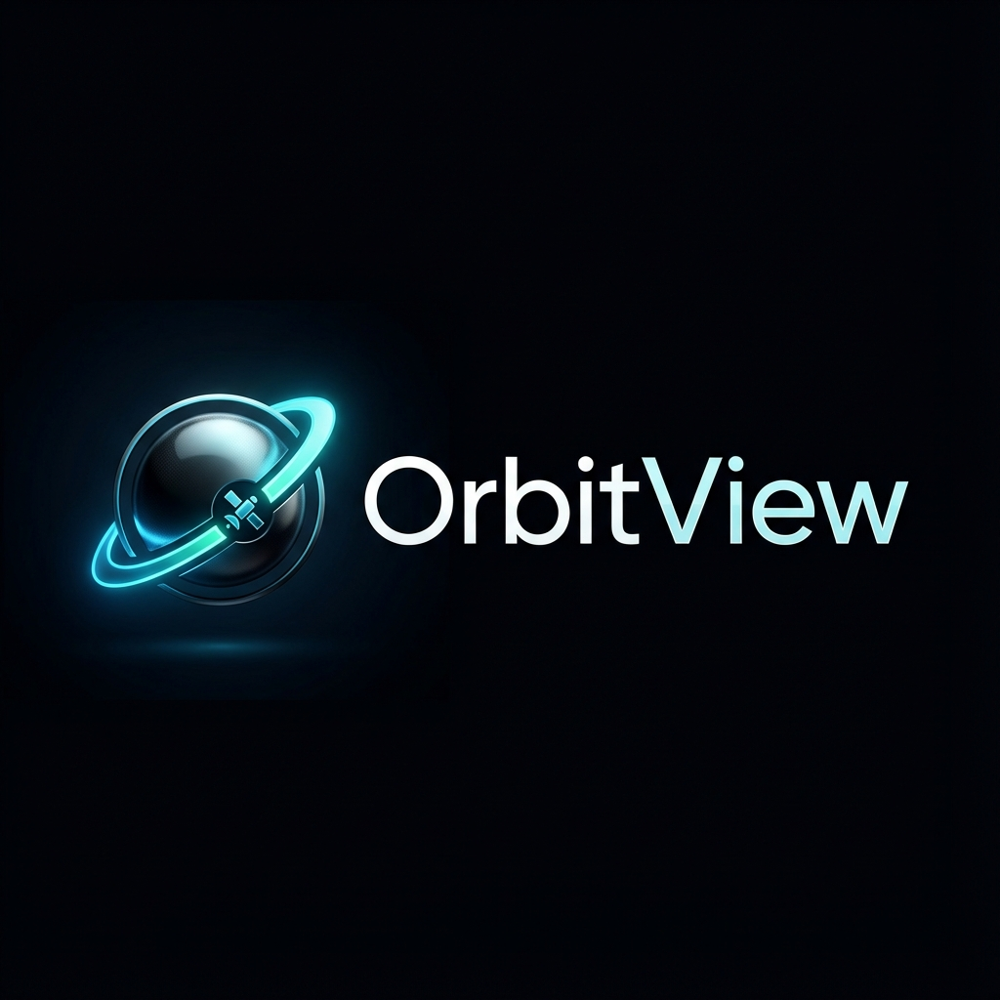
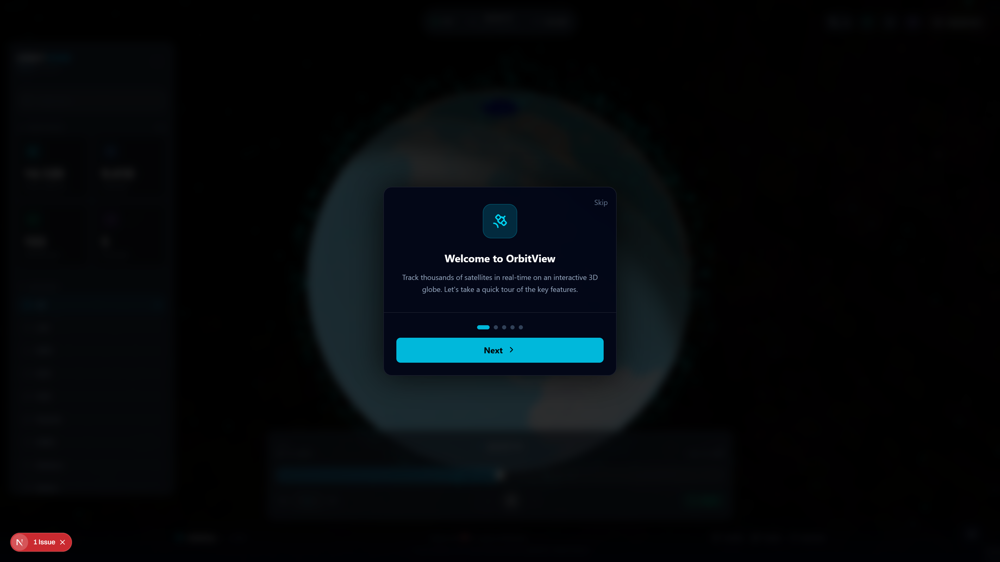
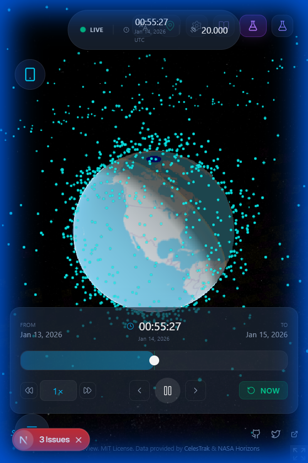

<div align="center">
  
  
  # OrbitView
  
  **Real-time Satellite Tracking & Visualization Platform**
  
  [](https://opensource.org/licenses/MIT)
  [](https://www.typescriptlang.org/)
  [](https://nextjs.org/)
  [](CONTRIBUTING.md)
  
  [Live Demo](https://orbitview.vercel.app) · [Documentation](THEORY.md) · [Report Bug](https://github.com/SpaceEngineerSS/OrbitView/issues)
</div>

---

## 📸 Showcase

<div align="center">
  <table>
    <tr>
      <td align="center"><strong>Desktop View</strong></td>
      <td align="center"><strong>Mobile View</strong></td>
    </tr>
    <tr>
      <td></td>
      <td></td>
    </tr>
  </table>
</div>

## ✨ Features

- 🛰️ **Real-time SGP4 Propagation** — Web Worker-driven batch processing for 10,000+ satellites at 60 FPS
- 🌍 **High-Fidelity Inertial Orbit Rendering** — Fixed GMST algorithm shows true Kepler rings (not ground tracks)
- ⚡ **Offline-First Architecture** — IndexedDB caching with Stale-While-Revalidate for instant startup
- 📱 **Adaptive UI** — Touch-first controls with responsive glass-morphism design
- 🔬 **Scientific Dashboard** — Doppler shift, pass predictions, orbital decay analysis
- 🎯 **Deep Linking** — Share satellite tracking URLs with `?sat=NORAD_ID`

## 🛠️ Tech Stack

| Category | Technology |
|----------|------------|
| **Framework** | Next.js 15 (App Router, Turbopack) |
| **3D Engine** | Cesium + Resium |
| **Language** | TypeScript 5.0 |
| **Styling** | Tailwind CSS 4.0 |
| **State** | Zustand |
| **Physics** | satellite.js (SGP4/SDP4) |
| **Caching** | Native IndexedDB |

## 🔬 Scientific Accuracy

OrbitView implements **scientifically validated** orbital mechanics:

- **SGP4/SDP4 Propagation** — Industry-standard algorithm for LEO/MEO/GEO orbits
- **Inertial Frame Rendering** — True Kepler ellipses using fixed GMST transformation
- **GMST Calculation** — Proper Greenwich Mean Sidereal Time for ECI→ECF conversion

> For detailed technical documentation, see [THEORY.md](THEORY.md)

## 🚀 Getting Started

### Prerequisites

- Node.js 18+ 
- npm or yarn

### Installation

```bash
# Clone the repository
git clone https://github.com/SpaceEngineerSS/OrbitView.git
cd OrbitView

# Install dependencies
npm install

# Set up environment variables
cp .env.example .env.local
# Add your Cesium Ion access token to .env.local

# Start development server
npm run dev
```

Open [http://localhost:3000](http://localhost:3000) to see the application.

### Environment Variables

```env
NEXT_PUBLIC_CESIUM_ACCESS_TOKEN=your_cesium_token_here
```

Get your free Cesium Ion token at [cesium.com/ion](https://cesium.com/ion/).

## 📁 Project Structure

```
src/
├── app/                 # Next.js App Router pages
├── components/
│   ├── Globe/          # Cesium globe & satellite rendering
│   ├── HUD/            # UI panels & controls
│   └── Scientific/     # Analysis dashboards
├── hooks/              # Custom React hooks
├── lib/                # Core utilities (SGP4, TLE parsing)
├── workers/            # Web Workers for heavy computation
└── store/              # Zustand state management
```

## 🧪 Testing

```bash
# Run all tests
npm test

# Run with coverage
npm run test:coverage

# Type checking
npm run type-check
```

## 🤝 Contributing

Contributions are welcome! Please see [CONTRIBUTING.md](CONTRIBUTING.md) for guidelines.

## 📄 License

This project is licensed under the MIT License - see the [LICENSE](LICENSE) file for details.

## 🙏 Acknowledgments

- [CelesTrak](https://celestrak.org/) — TLE data source
- [Cesium](https://cesium.com/) — 3D globe engine
- [satellite.js](https://github.com/shashwatak/satellite-js) — SGP4 implementation

---

<div align="center">
  <sub>Built with ❤️ by the OrbitView Team</sub>
</div>
