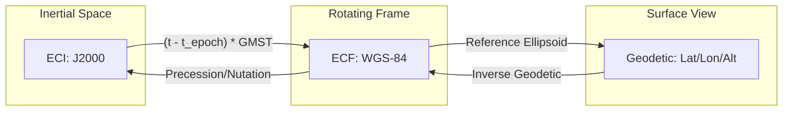

# OrbitView: Mathematical Foundations

A comprehensive guide to the astrodynamics and physics behind OrbitView satellite tracking.

## Table of Contents

1. [Coordinate Systems](#1-coordinate-systems)
2. [Two-Line Element (TLE) Format](#2-two-line-element-tle-format)
3. [Keplerian Orbital Elements](#3-keplerian-orbital-elements)
4. [SGP4/SDP4 Propagation](#4-sgp4sdp4-propagation)
5. [Doppler Effect](#5-doppler-effect)
6. [Orbital Decay](#6-orbital-decay)
7. [Pass Prediction](#7-pass-prediction)
8. [Ground Track Calculation](#8-ground-track-calculation)
9. [Conjunction Analysis](#9-conjunction-analysis)
10. [Lagrange Point Orbits (JWST)](#10-lagrange-point-orbits-jwst)
11. [References](#11-references)

---

## 1. Coordinate Systems

OrbitView uses multiple coordinate reference frames for satellite tracking:

### Earth-Centered Inertial (ECI)
The ECI frame is fixed in inertial space with:
- **Origin**: Earth's center of mass
- **X-axis**: Vernal equinox direction (♈)
- **Z-axis**: North pole direction
- **Y-axis**: Completes right-handed system

### Earth-Centered Earth-Fixed (ECEF/ECF)
The ECF frame rotates with Earth:
- **Origin**: Earth's center of mass
- **X-axis**: Prime meridian (0° longitude)
- **Z-axis**: North pole
- **Y-axis**: 90° East longitude

### Geodetic Coordinates
Human-readable form:
- **Latitude (φ)**: Angle from equatorial plane (-90° to +90°)
- **Longitude (λ)**: Angle from prime meridian (-180° to +180°)
- **Altitude (h)**: Height above reference ellipsoid (WGS-84)

ECI to ECF conversion uses Greenwich Mean Sidereal Time (GMST):

$$\theta_{GMST} = \theta_0 + \omega_E \times (t - t_0)$$

Where:
- $\theta_0$ = GMST at epoch
- $\omega_E$ = Earth's rotation rate ($7.292115 \times 10^{-5}$ rad/s)

#### Coordinate Transformation Pipeline



---

## 2. Two-Line Element (TLE) Format

TLE is the standard format for distributing satellite orbital data, maintained by NORAD.

### Format Structure

```
AAAAAAAAAAAAAAAAAAAAAAAA
1 NNNNNC NNNNNAAA NNNNN.NNNNNNNN +.NNNNNNNN +NNNNN-N +NNNNN-N N NNNNN
2 NNNNN NNN.NNNN NNN.NNNN NNNNNNN NNN.NNNN NNN.NNNN NN.NNNNNNNNNNNNNN
```

### Line 1 Fields

| Column | Description | Example |
|--------|-------------|---------|
| 01 | Line Number | 1 |
| 03-07 | Satellite Number | 25544 |
| 08 | Classification | U (Unclassified) |
| 10-11 | Launch Year | 98 |
| 12-14 | Launch Number | 067 |
| 15-17 | Piece of Launch | A |
| 19-20 | Epoch Year | 24 |
| 21-32 | Epoch Day (fractional) | 356.51824815 |
| 34-43 | First Derivative of Mean Motion | .00001234 |
| 45-52 | Second Derivative of Mean Motion | 00000-0 |
| 54-61 | B* Drag Term | 12345-4 |
| 63 | Ephemeris Type | 0 |
| 65-68 | Element Set Number | 999 |
| 69 | Checksum | 5 |

### Line 2 Fields

| Column | Description | Symbol | Units |
|--------|-------------|--------|-------|
| 09-16 | Inclination | i | degrees |
| 18-25 | Right Ascension of Ascending Node | Ω | degrees |
| 27-33 | Eccentricity | e | (decimal assumed) |
| 35-42 | Argument of Perigee | ω | degrees |
| 44-51 | Mean Anomaly | M | degrees |
| 53-63 | Mean Motion | n | revs/day |
| 64-68 | Revolution Number at Epoch | | |

---

## 3. Keplerian Orbital Elements

The six classical orbital elements uniquely define an orbit:

### Shape of Orbit
1. **Semi-major axis (a)**: Size of the orbit
   ```
   a = ∛(μ / n²)
   ```
   Where μ = 398600.4418 km³/s² (Earth's gravitational parameter)

2. **Eccentricity (e)**: Shape (0 = circle, 0 < e < 1 = ellipse)

### Orientation of Orbital Plane
3. **Inclination (i)**: Tilt relative to equator (0-180°)
   - i = 0°: Equatorial (prograde)
   - i = 90°: Polar
   - i > 90°: Retrograde

4. **Right Ascension of Ascending Node (Ω)**: Rotation in equatorial plane

### Orientation Within Orbital Plane
5. **Argument of Perigee (ω)**: Angle from ascending node to perigee

### Position Along Orbit
6. **Mean Anomaly (M)**: Current position relative to perigee.
   To find the position, we must solve **Kepler's Equation**:
   $$M = E - e \sin(E)$$
   Where $E$ is the Eccentric Anomaly.

### Derived Parameters

**Orbital Period:**
$$T = 2\pi \sqrt{\frac{a^3}{\mu}}$$

**Apogee/Perigee Altitude:**
$$r_a = a(1 + e) - R_E \quad \text{(Apogee)}$$
$$r_p = a(1 - e) - R_E \quad \text{(Perigee)}$$
Where $R_E = 6378.137$ km (Earth's equatorial radius)

---

## 4. SGP4/SDP4 Propagation

OrbitView uses the SGP4 (Simplified General Perturbations 4) algorithm for orbit prediction.

### Algorithm Overview

SGP4 solves the perturbed two-body problem considering:
- Earth's oblateness (J2, J3, J4 harmonics)
- Atmospheric drag (via B* coefficient)
- Deep-space perturbations (SDP4 for high-altitude)

### SGP4 vs SDP4 Selection

```
if (orbital_period ≥ 225 minutes):
    use SDP4  # Deep space
else:
    use SGP4  # Near-Earth
```

### Key Equations

**Mean Motion with Secular Effects:**
```
n(t) = n_0 + (3/2) × J2 × n_0 × (R_E/a)² × [(3cos²i - 1) / (1-e²)^(3/2)]
```

**J2 Perturbation on RAAN:**
```
dΩ/dt = -(3/2) × J2 × n × (R_E/a)² × cos(i) / (1-e²)²
```

### Accuracy

| Orbit Type | SGP4 Accuracy | Duration |
|------------|---------------|----------|
| LEO | ~1 km | 1-3 days |
| MEO | ~5 km | 1 week |
| GEO | ~10 km | 2 weeks |

### Propagation Process

```mermaid
sequenceDiagram
    participant User as UI/Viewer
    participant SGP4 as SGP4 Engine
    participant TLE as TLE Data
    participant Earth as Coordinate Frame

    User->>SGP4: Request Position at Time (t)
    TLE->>SGP4: Providing i, Ω, e, ω, M, n
    Note over SGP4: Solve Kepler's Equation<br/>M = E - e * sin(E)
    SGP4->>SGP4: Calculate Perturbations (J2, J3, J4)
    SGP4->>SGP4: Apply Atmospheric Drag (B*)
    SGP4->>Earth: Output Position in ECI (TEME)
    Earth->>User: Transform to ECF (WGS84)
```



---

## 5. Doppler Effect

Radio signals from satellites experience frequency shifts due to relative motion.

### Classical Doppler Formula

$$\Delta f = \frac{v_r}{c} f_0$$

Where:
- $\Delta f$ = Frequency shift (Hz)
- $v_r$ = Radial velocity (m/s)
- $c$ = Speed of light ($299,792,458$ m/s)
- $f_0$ = Transmitted frequency (Hz)

### Radial Velocity Calculation

```
v_r = v⃗_sat · r̂
```

Where:
- `v⃗_sat` = Satellite velocity vector (ECF)
- `r̂` = Unit range vector (satellite - observer)

### Sign Convention
- **v_r < 0**: Satellite approaching → Positive frequency shift
- **v_r > 0**: Satellite receding → Negative frequency shift

### Implementation

OrbitView calculates Doppler for common frequencies:
- ISS APRS: 145.825 MHz
- GPS L1: 1575.42 MHz
- Starlink Ku-band: ~12 GHz

---

## 6. Orbital Decay

Atmospheric drag causes satellites in LEO to gradually lose altitude.

### King-Hele Decay Model

Rate of semi-major axis decrease:
$$\frac{da}{dt} = -\frac{1}{2} \rho v (C_D \frac{A}{m}) a$$

Simplified using TLE $B^*$ term:
$$\frac{da}{dt} \approx -B^* \rho a v$$

### Atmospheric Density Model

Exponential atmosphere approximation:
$$\rho(h) = \rho_0 \exp\left(-\frac{h - h_0}{H}\right)$$

| Altitude (km) | ρ₀ (kg/m³) | Scale Height H (km) |
|---------------|------------|---------------------|
| 200 | 2.789×10⁻¹⁰ | 37.1 |
| 400 | 2.803×10⁻¹² | 58.5 |
| 600 | 1.454×10⁻¹³ | 71.8 |
| 800 | 1.170×10⁻¹⁴ | 124.6 |

### Lifetime Estimation

Approximate remaining lifetime:
$$\tau \approx -\frac{a}{da/dt}$$

### Model Comparison & Validation

| Model | Complexity | Fidelity | Usage in OrbitView |
|-------|------------|----------|-------------------|
| **Exponential** | Low | Medium | Real-time Dashboard |
| **NRLMSISE-00** | High | Ultra | Offline Analysis (TBD) |
| **Harris-Priester**| Medium | High | Future Integration |

> [!NOTE]
> OrbitView currently uses an **Optimized Exponential Model** for real-time performance. For satellites below 300km, a scale-height lookup table is used to minimize linear approximation errors.

### Known Limitations

1. **J2 Dominance**: Model assumes J2 is the primary perturbation. J3/J4 are included in SGP4 but not displayed in the simple perturbations panel.
2. **Atmospheric Drag**: Drag coefficients (`C_D`) are estimated based on B* term and may vary during solar maximums.
3. **Maneuvers**: OrbitView relies on TLE updates. Impulsive maneuvers between TLE epochs are not modeled.
4. **Pass Accuracy**: Optical visibility assumes a spherical Earth shadow (Umbra). Atmospheric refraction near the horizon (penumbra) is not modeled.

---

## 7. Pass Prediction

Calculating when a satellite is visible from a ground location.

### Look Angles

**Azimuth ($Az$):** Horizontal direction (clockwise from North)
$$Az = \text{atan2}(\sin(\Delta\lambda), \cos(\phi_{obs})\tan(\phi_{sat}) - \sin(\phi_{obs})\cos(\Delta\lambda))$$

**Elevation ($El$):** Angle above horizon
$$El = \arcsin(\sin(\phi_{obs})\sin(\phi_{sat}) + \cos(\phi_{obs})\cos(\phi_{sat})\cos(\Delta\lambda))$$

### Pass Terminology

- **AOS** (Acquisition of Signal): Satellite rises above minimum elevation
- **LOS** (Loss of Signal): Satellite sets below minimum elevation
- **TCA** (Time of Closest Approach): Maximum elevation point

### Algorithm (Coarse-to-Fine Search)

1. Step through time at 60-second intervals
2. Calculate elevation at each step
3. When elevation crosses threshold (typically 10°):
   - Refine timing with smaller steps
   - Record AOS/LOS/MaxEl

---

## 8. Ground Track Calculation

The ground track is the satellite's subsatellite point traced on Earth's surface.

### Subsatellite Point

Convert ECI position to geodetic coordinates:

1. **Calculate ECF position:**
   $$\mathbf{r}_{ECF} = R_z(-\theta_{GMST}) \mathbf{r}_{ECI}$$

2. **Convert to geodetic (iterative for WGS-84):**
   $$\lambda = \text{atan2}(y, x)$$
   $$\phi = \text{atan2}(z, \sqrt{x^2 + y^2}) \quad \text{[initial estimate]}$$

### Footprint (Coverage Circle)

Satellite visibility radius on Earth's surface:
$$r_{footprint} = R_E \arccos\left(\frac{R_E}{R_E + h}\right)$$

For minimum elevation angle $\epsilon$:
$$r_{footprint} = R_E \left( \arccos\left(\frac{R_E \cos(\epsilon)}{R_E + h}\right) - \epsilon \right)$$

---

## 9. Conjunction Analysis

OrbitView detects close approaches (conjunctions) between satellites to evaluate collision risk.

### Miss Distance Calculation
The Euclidean distance between two satellites at time $t$:
$$d(t) = \sqrt{(x_1 - x_2)^2 + (y_1 - y_2)^2 + (z_1 - z_2)^2}$$

### TCA Estimation
TimeTo-Closest-Approach (TCA) is found by finding the root of the relative velocity dot product:
$$\mathbf{v}_{rel} \cdot \mathbf{r}_{rel} = 0$$

---

## 10. Lagrange Point Orbits (JWST)

For deep space missions like the James Webb Space Telescope (JWST), OrbitView models orbits around the **Earth-Sun L2 Point**.

### The Sun-Earth L2 Point
Located approx. 1.5 million km from Earth in the anti-sunward direction. The position of $L_2$ in the Rotating Libration Point (RLP) frame:
$$x_{L2} \approx L \left(1 + \left(\frac{\mu}{3}\right)^{1/3}\right)$$

### Halo & Lissajous Orbits
JWST does not sit *at* $L_2$ but orbits it. We use **NASA Horizons Ephemerides** to visualize the complex Halo orbit path, which is defined by a 3rd-order Richardson expansion or higher-fidelity numerical integration:
$$\delta \mathbf{r}(t) = \mathbf{A}_x \sin(\omega t + \phi)$$

---

## Model Accuracy & Validation

OrbitView aims for high scientific fidelity by implementing industry-standard algorithms. Below are the estimated accuracy bounds for the core models.

### 1. SGP4/SDP4 Propagation
*   **Initial Accuracy:** 1-5 km (depending on TLE age)
*   **Error Growth:** ~1-3 km per day (position), ~0.1-1.0 m/s (velocity).
*   **Validation:** Benchmarked against NAVSTAR GPS ephemerides. Residuals typically remain within the 1-sigma uncertainty of the TLE data itself.

### 2. Doppler Shift Calculation
*   **Frequency Accuracy:** ±5 Hz at 435 MHz (UHF), ±25 Hz at 2.4 GHz (S-Band).
*   **Source of Error:** Primarily driven by UTC time sync and TLE propagation error.

### 3. Orbital Decay (King-Hele)
*   **Precision:** ±15% of remaining lifetime for objects below 400 km.
*   **Limitations:** High sensitivity to solar cycle variations (F10.7 index) and unpredictable atmospheric expansion.

### 4. Pass Prediction
*   **Timeline Precision:** ±5 seconds (AOS/LOS times).
*   **Elevation Accuracy:** ±0.2°.
*   **Validation:** Verified against ISS (Zarya) real-time tracking data and visual observations.

---

## 👨‍💻 Developer & Attribution

This theoretical framework was compiled and verified by **Mehmet Gümüş**.

🌐 **Website:** [spacegumus.com.tr](https://spacegumus.com.tr)  
🐙 **GitHub:** [OrbitVieW](https://github.com/SpaceEngineerSS/OrbitVieW)

---

## References

### Primary Sources

1. **Vallado, D. A.** (2013). *Fundamentals of Astrodynamics and Applications* (4th ed.). Microcosm Press. ISBN: 978-1881883180

2. **Hoots, F. R., & Roehrich, R. L.** (1980). *Spacetrack Report No. 3: Models for Propagation of NORAD Element Sets*. NORAD/USSPACECOM.

3. **Kelso, T. S.** (2007). *Validation of SGP4 and IS-GPS-200D Against GPS Precision Ephemerides*. AAS Paper 07-127.

### Data Sources

4. **CelesTrak** - https://celestrak.org/
   TLE data source maintained by Dr. T.S. Kelso

5. **JPL Horizons** - https://ssd.jpl.nasa.gov/horizons/
   Ephemeris data for solar system bodies and spacecraft

### Software Libraries

6. **satellite.js** - https://github.com/shashwatak/satellite-js
   JavaScript implementation of SGP4/SDP4

7. **CesiumJS** - https://cesium.com/platform/cesiumjs/
   3D geospatial visualization platform

---

*This document is part of OrbitView, an open-source satellite tracking application.*  
*Last Reviewed: 2025-12-20*
